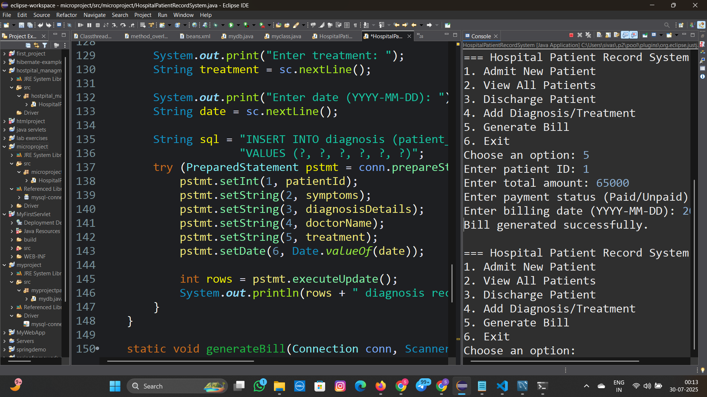
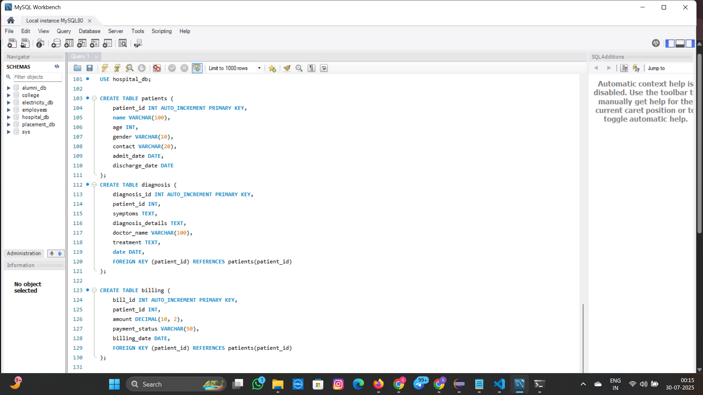

# 🏥 Hospital Patient Record System (JDBC + MySQL)

A console-based **Hospital Patient Record Management System** built using **Java (JDBC)** and **MySQL**.  
This project allows hospitals to manage patients, diagnoses, discharges, and billing records in an organized way.

---

## Features
- ➕ Admit new patients  
- 📋 View all patient details  
- ❌ Discharge patients with date tracking  
- 🩺 Add diagnosis & treatment records  
- 💰 Generate and manage bills

---

## Tech Stack
- **Java (JDK 17+)**
- **JDBC (MySQL Connector/J)**
- **MySQL Database**
- **Eclipse/IntelliJ/VS Code** (any Java IDE)

---
---

## Database Schema
This project uses a MySQL database named `hospital_db` with three tables: `patients`, `diagnosis`, and `billing`.

Create them using `database/schema.sql` (example below):

```sql
CREATE DATABASE IF NOT EXISTS hospital_db;
USE hospital_db;

CREATE TABLE IF NOT EXISTS patients (
    patient_id INT AUTO_INCREMENT PRIMARY KEY,
    name VARCHAR(100),
    age INT,
    gender VARCHAR(10),
    contact VARCHAR(20),
    admit_date DATE,
    discharge_date DATE
);

CREATE TABLE IF NOT EXISTS diagnosis (
    diagnosis_id INT AUTO_INCREMENT PRIMARY KEY,
    patient_id INT,
    symptoms TEXT,
    diagnosis_details TEXT,
    doctor_name VARCHAR(100),
    treatment TEXT,
    date DATE,
    FOREIGN KEY (patient_id) REFERENCES patients(patient_id)
);

CREATE TABLE IF NOT EXISTS billing (
    bill_id INT AUTO_INCREMENT PRIMARY KEY,
    patient_id INT,
    amount DECIMAL(10,2),
    payment_status VARCHAR(50),
    billing_date DATE,
    FOREIGN KEY (patient_id) REFERENCES patients(patient_id)
);
```

---

## Configuration
Update your DB settings (prefer environment variables for security):

```java
static final String DB_URL = "jdbc:mysql://localhost:3306/hospital_db";
static final String USER   = System.getenv("DB_USER"); // e.g., set DB_USER=root
static final String PASS   = System.getenv("DB_PASS"); // e.g., set DB_PASS=******
```

On Windows (PowerShell), you can set env vars temporarily like:
```powershell
$env:DB_USER="root"
$env:DB_PASS="yourpassword"
```

---

## Build & Run (Windows, Command Prompt)
From the project root:

```bat
REM Compile to out/ with MySQL driver on classpath
javac -d out -cp .;lib\mysql-connector-j-8.4.0.jar src\microproject\HospitalPatientRecordSystem.java

REM Run using fully-qualified class name
java -cp out;lib\mysql-connector-j-8.4.0.jar microproject.HospitalPatientRecordSystem
```

> On macOS/Linux use `:` instead of `;` for the classpath separator.

---

## Screenshots








---

## Future Enhancements
- GUI (JavaFX or Spring Boot)
- Export patient history & bills as PDF
- Authentication & user roles (admin, doctor, billing staff)

---
